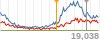

ophan-sparks
============

Server-generated pageview graphs (PNG) for Guardian's Ophan. A url like this:
```
http://example.com:3000/?path=/technology/2013/dec/27/facebook-dead-and-buried-to-teens-research-finds
```
...should return a PNG (100x40px) like this:



## Installation

    $ npm install

Unless previously installed, you'll need __Cairo__. For installation, see the [Wiki](https://github.com/LearnBoost/node-canvas/wiki/_pages) from the [node-canvas](https://github.com/LearnBoost/node-canvas) project.
