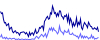
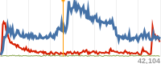

Pageview Sparks
===============

__Small server-generated images, that graph page-views for Guardian content. Uses Ophan data__. 

* Defaults settings, plus an orange marker   
  
`?page=/2013/dec/29/foo/bar&markers=1388408200:ff9900`

* Smaller, showing total only, hiding furniture  
  
`?page=/2013/dec/29/foo/bar&graphs=total&showHours=0&showStats=0&width=50&height=20`

* Facebook & Twitter, lowering the "hot" threshold  
  
`?page=/2013/dec/29/foo/bar&graphs=twitter:6666ff,facebook:000099&showHours=0&showStats=0&hotLevel=10`

* Larger width & height, plus an orange marker  
  
`?page=/2013/dec/29/foo/bar&markers=1388387000:ff9900&width=200&height=80`


### Query string params:

Required

* __page__ : url of the Guardian content. Only the pathname part is used.

Optional

* __graphs__ : comma-separated names of series from the Ophan breakdown, with optional hex colours (after a colon), e.g. `twitter:6666ff,facebook:000099`. The names `total` and `other` also work. Default shows `guardian`, `google`, and `other`.

* __markers__ : comma-separated vertical markers, as unix timestamps, with optional hex colours (after a colon), e.g. `1388408200:ff9900,1388409900:cccccc`

* __width__ : in pixels. Default is 100.

* __height__ : in pixels. Default is 40.

* __hotLevel__:  pageviews-per-min level that triggers an emphasised graph line. The line will go bold at half this value, and extra-bold beyond it. This is also the level at which the graph compresses vertically. Default is 50.

* __hotPeriod__ : number of recent minutes over which to calcuate the hotLevel. Default is 3.

* __showStats__ : show the total hits counter. Default is `true`.

* __showHours__ :  show the elapsed hour markers. Default is `true`.


### Installation

Requires Node and Cairo. For Cairo installation, see the dependencies part of [Wiki](https://github.com/LearnBoost/node-canvas/wiki/_pages) from the [node-canvas](https://github.com/LearnBoost/node-canvas) project. Then:

```
$ npm install
```
