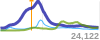

Pageview Sparks
===============

__Small server-generated graphs of Guardian content page-views. Uses Ophan data__. 

* Default rendering:  
  
```
?page=http://www.theguardian.com/football/2014/jan/05/fa-cup-fourth-round-draw-live
```

* Seperate graphs specified, dimensions doubled:  
  
```
...&graphs=guardian:000099,other:0099ff,google:669900&width=100&height=40
```

* With a marker point, total pageviews, and elapsed hour vertical bars:  
  
```
...&markers=1388747300:ff9900&showStats=1&showHours=1
```

* Fully loaded...  
  
```
...&smoothing=15&markers=1388901600:f90,1388923200:000,&graphs=guardian:009,other:ccc,twitter:09f,facebook:0CC,google:690&width=300&height=100&hotLevel=2000&&showStats=1&showHours=1
```

If the number of data points is greater than the width of the graph, the points are resampled to fit. If the number of data points is less than the width, the graph is right-justified (so "now" aligns for vertically stacked graphs) and it's width is partially stretched to make the graph more readable. Smoothing is applied, and can be adjusted. Set the `hotLevel` parameter to indicate "significant pageviews per minute" for the type of content in question. This affects the y-scale of the graph. 

### Query string params:

* __page__ : url of the Guardian content. Only the pathname part is used. Default is the empty string.

* __graphs__ : comma-separated names of dataseries from the Ophan breakdown, with optional hex colours (after a colon), e.g. `twitter:6666ff,facebook:000099`. The following are in Ophan at time of writing:
    * `guardian`,
    * `unknown - to content`
    * `unknown - to front`
    * `google`
    * `twitter`
    * `facebook`
    * `reddit`
    * `drudge report`
    * `outbrain`
    * `other`  
    Also supported is `total`, which is the default.

* __markers__ : comma-separated vertical markers, as unix timestamps, with optional hex colours (after a colon), e.g. `1388408200:ff9900,1388409900:cccccc`

* __width__ : in pixels. Default is 50.

* __height__ : in pixels. Default is 20.

* __showStats__ : show the total hits counter, when set to `1`. Default is `0`.

* __showHours__ :  show the elapsed hour markers, when set to `1`. Default is `0`.

* __hotLevel__:  upper y-bound of the graph, in pageviews-per-minute. Beyond this, the whole graph compresses vertically. Default is `50` which is appropriate for articles; fronts need a much higher figure. Recent activity beyond this level causes a bold graph line (and a half-bold line at half this level). 

* __hotPeriod__ : number of minutes over which to calcuate the "recent activity" above. Default is `5`.

* __alpha__ : opacity of the graph lines. Range from 0 - 1. Default is `0.7`.

* __smoothing__ : number of pixels over which to compute a moving average. For larger widths, this is worth increasing. Default is `5`.

### Installation

Requires Node and [Cairo](http://cairographics.org/).

For Cairo installation, see the dependencies part of [Wiki](https://github.com/LearnBoost/node-canvas/wiki/_pages) from the [node-canvas](https://github.com/LearnBoost/node-canvas) project.

Then:

```
$ npm install
```

Create a file called `config.json` with `ophanHost` and `ophanKey` properties (see `sample-config.json`).

Then in a browser: `http://localhost:3000/?page=/uk`
