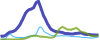

Pageview Sparks
===============

__Small server-generated images, that graph page-views for Guardian content. Uses Ophan data__. 

* Defaults settings  
  
`?page=/uk/sport`

* Seperate graphs specified, orange marker point, doubled dimensions  
  
`...&graphs=other:d61d00,google:89A54E,guardian:4572A7&width=100&height=40&markers=1388680400:ff9900`

* As above, with total pageviews and elapsed hour bars  
  
`...&showStats=1&showHours=1`

* As above, even larger  
  
`...&width=200&height=80`

* Graphing Facebook & Twitter, lowering the "hot" threshold  
  
`...&graphs=twitter:6666ff,facebook:000099&hotLevel=10`


### Query string params:

Required

* __page__ : url of the Guardian content. Only the pathname part is used.

Optional

* __graphs__ : comma-separated names of dataseries from the Ophan breakdown, with optional hex colours (after a colon), e.g. `twitter:6666ff,facebook:000099`. The following are in Ophan at time of writing: `guardian`, `unknown - to content`, `unknown - to front`, `google`, `twitter`, `facebook`, `reddit`, `drudge report`, `outbrain`, `other`. Also supported is `total`, which is the default.

* __markers__ : comma-separated vertical markers, as unix timestamps, with optional hex colours (after a colon), e.g. `1388408200:ff9900,1388409900:cccccc`

* __width__ : in pixels. Default is 50.

* __height__ : in pixels. Default is 20.

* __hotLevel__:  pageviews-per-min level that triggers an emphasised graph line. The line will go bold at half this value, and extra-bold beyond it. This is also the level at which the graph compresses vertically. Default is 50, which seems appropriate for articles; fronts need a higher figure, e.g. 250.

* __hotPeriod__ : number of recent minutes over which to calcuate the hotLevel. Default is 3.

* __showStats__ : show the total hits counter, when set to `1`. Default is `0`.

* __showHours__ :  show the elapsed hour markers, when set to `1`. Default is `0`.

* __smoothing__ : number of pixels over which to compute a moving average. Default is `3`.

### Installation

Requires Node and Cairo. For Cairo installation, see the dependencies part of [Wiki](https://github.com/LearnBoost/node-canvas/wiki/_pages) from the [node-canvas](https://github.com/LearnBoost/node-canvas) project. Then:

```
$ npm install
```
